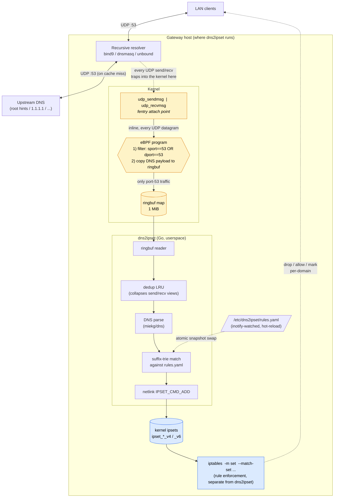

# dns2ipset — Architecture

This document captures the architecture, component breakdown, design
decisions, known limitations, and metrics for `dns2ipset`. It is the
single source of truth for *how* and *why* the daemon works; the
[README](README.md) covers *what it is* and how to build/deploy it.

---

## Context

A multi-homed Linux box runs a local DNS resolver (bind9, dnsmasq, or
unbound) that serves clients on the LAN. We want to drop or allow traffic
by **domain** using standard `iptables`, but `iptables` only matches IPs.
The bridge: snoop DNS replies, and as A/AAAA records are seen for
"interesting" domains, push the resolved IPs into named `ipset`s.
Existing `iptables` rules then match the sets (`-m set --match-set …`).

A separate already-built tool generates the rules — it produces unique
ipset names and emits a (domain → ipset name) mapping. dns2ipset consumes
that mapping and does the snooping + ipset population. Out of scope:
creating ipsets, writing iptables rules, generating the rule mappings.

The intended outcome: `dns2ipset` runs as a single Go binary on the
gateway, observes every DNS response served by the local resolver
(regardless of which network interface is involved), and keeps the
configured ipsets populated with the freshest resolution data, expiring
entries via the DNS TTL.

---

## High-level architecture

dns2ipset attaches **two eBPF programs** to the kernel via `fentry` at
`udp_sendmsg` and `udp_recvmsg`. Those are the syscall entry points every
UDP datagram traverses on its way in or out of any socket — so the daemon
sees every UDP packet processed by the host, regardless of which process
sent or received it. A port-53 filter inside the BPF program throws away
anything that isn't DNS; everything else is shipped up to userspace via a
ringbuf map. dns2ipset does not bind a socket, doesn't run as the
resolver, and isn't on the data path — it's a kernel-side observer.



**Where it snoops** (highlighted amber): the two `fentry` hooks on
`udp_sendmsg` and `udp_recvmsg`. Both hooks fire whether the resolver
served the answer from its cache or fetched it fresh from upstream — so
cached responses are observed too.

**What it does not do** (highlighted blue): create ipsets, manage
iptables, drop traffic, or otherwise affect the data path. dns2ipset
only *populates* sets that an upstream rule generator has already
created and that an iptables ruleset already references.

Userspace owns DNS parsing and rule matching. The kernel side is
intentionally thin: filter to port 53, ship the UDP payload up. This
keeps the eBPF code small and lets the rule trie hot-reload without
touching BPF maps.

---

## Components

### 1. eBPF program ([internal/bpf/c/dns2ipset.bpf.c](internal/bpf/c/dns2ipset.bpf.c))

- **Type:** two `fentry` programs.
- **Attach:** `fentry/udp_sendmsg` and `fentry/udp_recvmsg`. Both are
  hooked because cached resolver answers never trigger an upstream query
  (only `udp_sendmsg` sees those), while uncached upstream replies appear
  on `udp_recvmsg`. Userspace dedupes the overlap.
- **Filter:** read `inet_sport` / `inet_dport` from the socket; if neither
  equals 53, return.
- **Payload extraction:** read up to 4096 bytes of UDP payload from the
  `msghdr`'s iov; copy into a ringbuf record together with timestamp,
  family (4/6), direction (send/recv), and ports.
- **Maps:** one `BPF_MAP_TYPE_RINGBUF` (~1 MB).
- **Portability:** CO-RE via `vmlinux.h`; built with
  `clang -target bpf -O2 -g`. BTF is required at runtime — no kprobe
  fallback. Modern kernels only (≥ 5.4 with BTF, recommended ≥ 5.8).

### 2. Loader & ringbuf reader ([internal/bpf/loader.go](internal/bpf/loader.go))

- Uses `github.com/cilium/ebpf` and `bpf2go` to embed the compiled
  object. Single deployable artifact, `CGO_ENABLED=0`.
- One goroutine reads ringbuf records and pushes them onto a buffered
  channel for the worker pool.

### 3. Rule loader & watcher ([internal/rules/](internal/rules/))

- **Format:** YAML at `/etc/dns2ipset/rules.yaml`:
  ```yaml
  version: 1
  rules:
    - domain: example.com         # matches example.com AND *.example.com
      ipset_v4: ipset_example_v4        # pre-created with `timeout` flag
      ipset_v6: ipset_example_v6        # optional; omit to skip AAAA records
    - domain: ads.example.org
      ipset_v4: ipset_ads_v4
  ```
- **Matching:** suffix-based, case-insensitive, label-aligned.
  `example.com` matches `example.com`, `www.example.com`,
  `a.b.example.com`, but NOT `notexample.com`.
- **Reload:** inotify on the *parent directory* of the rules file (so
  atomic-rename writes are caught — `IN_MOVED_TO` for the target name,
  `IN_CLOSE_WRITE` for in-place edits). Trie is rebuilt off-thread and
  swapped via `atomic.Value`. In-flight events finish on the prior trie.
- **Validation:** initial load failure exits non-zero. Reload failures
  keep the prior trie and increment an error metric.
- **Duplicates:** last domain wins, warning logged.

### 4. Suffix trie ([internal/rules/trie.go](internal/rules/trie.go))

A **trie** (pronounced "try") is an in-memory tree keyed one piece at a
time, where branches sharing a prefix share nodes — so lookup cost is
proportional to the length of the key, not the number of stored entries.
For DNS suffix matching we feed the labels in **reverse** order so that
common parents (TLDs) sit near the root and a "terminal" marker on a node
means *any name ending here is a match*.

Example trie for rules `example.com` and `ads.example.org`:

```
(root)
├── com
│   └── example *      → ipset_example_v4 / ipset_example_v6
└── org
    └── example
        └── ads *       → ipset_ads_v4
```

`*` marks a terminal node. Looking up `a.b.example.com` walks
`com → example` right-to-left, hits the terminal, and returns the rule.
Cost is O(label-count) per lookup, with no allocations — and crucially
no disk or syscall on the hot path, since the whole trie lives in heap
memory (see §2 below).

### 5. DNS parser ([internal/dnsparse/](internal/dnsparse/))

- Thin wrapper over `github.com/miekg/dns` `dns.Msg.Unpack`.
- Extracts: txid, qname, qtype, response code, and the full chain of
  owner-names plus their A/AAAA records from the answer section.
- Drops anything that isn't a response (`QR=0`), has `RCODE != NOERROR`,
  or has zero answers.

### 6. Dedup LRU ([internal/dedup/](internal/dedup/))

- Key: `fnv64(qname || qtype || txid || fnv64(payload))`.
- 4096 entries, 200 ms TTL. Collapses the send/recv duplicate of the
  same response.

### 7. ipset client ([internal/ipset/](internal/ipset/))

- Netlink directly via `NFNL_SUBSYS_IPSET` (using
  `vishvananda/netlink`).
- One method: `Add(setName string, ip net.IP, ttl time.Duration) error`.
  Sets `IPSET_ATTR_TIMEOUT` to the DNS TTL, clamped to `[60s, 7d]`
  (configurable via flags `--ttl-min`, `--ttl-max`).
- Missing set → log once per (set, minute) at WARN; drop. Do not
  auto-create.

### 8. Pipeline ([internal/pipeline/](internal/pipeline/))

- Worker count defaults to `GOMAXPROCS`. Each worker: parse DNS → for
  each name in `{qname} ∪ owner-names`, look up in trie → for each match,
  dispatch every A record to `rule.ipset_v4` and every AAAA to
  `rule.ipset_v6`.
- Failures (parse, ipset write) are counted, never propagated; the
  pipeline keeps draining.

### 9. Entrypoint ([cmd/dns2ipset/main.go](cmd/dns2ipset/main.go))

Flags:
- `--rules` (default `/etc/dns2ipset/rules.yaml`)
- `--ttl-min` / `--ttl-max` (defaults `60s` / `168h`)
- `--metrics-addr` (off by default; e.g. `127.0.0.1:9301`)
- `--log-level` (`info` default)
- `--dedup-window` (default `200ms`)

Signals: `SIGTERM` → graceful drain; `SIGHUP` → force reload.

---

## Key design choices (the non-obvious bits)

### 1. C source lives in `internal/bpf/c/`, not `internal/bpf/`
Go's toolchain treats `.c` files in a Go package directory as cgo sources
and errors out with "C source files not allowed when not using cgo". The
C is moved one level down into `c/` and bpf2go is pointed at
`c/dns2ipset.bpf.c`.

### 2. Atomic snapshot store with pre-built trie
The active ruleset and its pre-built trie live **entirely in memory** —
the rules file is read from disk exactly twice in the daemon's lifecycle
per change: once at startup, and once each time the file is modified
(inotify-triggered). There is no per-lookup disk I/O, no re-parse, and
no syscall on the hot path.

`rules.Store` wraps a `*snapshot{RuleSet, Trie}` in an `atomic.Value`.
`Replace` does the expensive work off the hot path — parse YAML, build
a fresh trie — and then atomically swaps the new snapshot in. The
pipeline calls `Store.Trie()` once per DNS event: a single atomic
pointer load, followed by an in-memory trie walk. In-flight lookups
holding the previous snapshot finish on it safely; it's garbage-collected
once the last reference drops. `Replace(nil)` is a deliberate no-op (an
`atomic.Value` typed-nil would panic).

### 3. Pipeline workers exit on events-channel close, not on ctx
An earlier iteration had `select { ctx.Done() | events }` in workers,
which raced shutdown into silently dropping buffered events. `Run()`
already closes `events` after the source returns; workers just
`for ev := range events`. Don't reintroduce the ctx-watch in the worker.

### 4. CNAME synthesis in the DNS parser
The plan's spec test demands CNAME owner-names appear in
`Response.Records`, so `dnsparse.Parse` does a second pass: for every
CNAME owner whose target has matching A/AAAA records in the same
response, append a synthetic record under the CNAME owner with the
target's IPs. **All matches**, not just the first — CDN responses
commonly return multiple A records per name.

### 5. Trie is shortest-suffix-wins
Per the design ("first terminal match wins walking right-to-left"). If
both `example.org` and `ads.example.org` are configured, a query for
`foo.ads.example.org` resolves to `example.org`'s ipset. Unusual — most
DNS suffix matching uses longest-match. Tests lock this in
(`TestTrie_ShortestSuffixWins`); changing it requires a design amendment.

### 6. BPF: per-CPU scratch + `bpf_ringbuf_output`
`struct event` is ~4112 bytes — far too large for the 512-byte BPF stack
— so we use a `BPF_MAP_TYPE_PERCPU_ARRAY` of size 1 as scratch. We also
use `bpf_ringbuf_output` instead of `bpf_ringbuf_reserve` +
`__builtin_memcpy` + `bpf_ringbuf_submit`: clang-11 with `-target bpf`
won't inline a 4 KB `__builtin_memcpy` and the verifier rejects the
resulting `memcpy` call. `bpf_ringbuf_output` is the explicit helper for
this case.

### 7. CO-RE field-existence guard for `iov_iter`
Kernel 5.x has `iov_iter.iov`, 6.x renamed it to `iov_iter.__iov`. The C
uses `bpf_core_field_exists(iter.__iov)` to pick at load time. The
hand-written `vmlinux.h` shim must declare both fields (typically as a
union) for the guard to compile. This is what makes a single .deb
portable across the 5.x → 6.x kernel boundary.

### 8. Force-reload paths
Two ways: (a) inotify watches the parent dir of `rules.yaml` and fires
on `IN_MOVED_TO` (atomic rename) or `IN_CLOSE_WRITE` (in-place edit);
(b) `SIGHUP` triggers the same reload closure. Reload failure keeps the
prior trie in effect and increments
`dns2ipset_rules_reload_total{result="error"}`.

---

## Operational details

- **Privileges:** `CAP_BPF` + `CAP_PERFMON` for BPF load;
  `CAP_NET_ADMIN` for ipset writes. The systemd unit grants these via
  `AmbientCapabilities=` rather than running as root.
- **Resource limits:** `MemoryHigh=128M`, `LimitNOFILE=4096`. Ringbuf
  1 MB.
- **Service ordering:** `After=` and `Wants=` (not `Requires=`) the
  resolver unit, so a snoop failure cannot break DNS.
- **Failure modes:**
  - Ringbuf full → kernel drops; metric `dns2ipset_ringbuf_drops_total`
    (see Known limitations).
  - Malformed DNS → counted as `parse_errors_total`, debug-logged with
    payload hex.
  - Missing ipset → rate-limited WARN, increment
    `ipset_errors_total{reason="missing"}`.
  - Reload error → metric `rules_reload_errors_total`; previous trie
    remains in effect.

---

## Metrics (Prometheus, optional)

Exposed on `--metrics-addr` when set (e.g. `127.0.0.1:9301`).

- `dns2ipset_events_total{direction}`
- `dns2ipset_parse_errors_total`
- `dns2ipset_dedup_hits_total`
- `dns2ipset_matches_total{rule}`
- `dns2ipset_ipset_writes_total{set,family}`
- `dns2ipset_ipset_errors_total{reason}`
- `dns2ipset_ringbuf_drops_total`
- `dns2ipset_rules_reload_total{result}`
- `dns2ipset_rules_active`

---

## Known limitations / TODOs

| Item | Where | Notes |
|---|---|---|
| `dns2ipset_ringbuf_drops_total` always 0 | [internal/bpf/loader.go](internal/bpf/loader.go) | cilium/ebpf v0.21 `ringbuf.Record` has no per-record loss count (that's a perf-buffer concept). Counter exists for future wiring. |
| `bpf_probe_read` order | [internal/bpf/c/dns2ipset.bpf.c](internal/bpf/c/dns2ipset.bpf.c) | Tries generic `bpf_probe_read` before `bpf_probe_read_kernel`. On kernels ≥ 5.14 the generic helper is deprecated; ideal order is `bpf_probe_read_user` for `udp_sendmsg`, `bpf_probe_read_kernel` for `udp_recvmsg`. Currently works on 6.1; revisit if loading fails on stricter kernels. |
| Trie semantics ambiguity | [internal/rules/trie.go](internal/rules/trie.go) | Shortest-suffix-wins per design; convention is longest. If we need longest match first, need to update the Lookup logic. |
| CI does not load BPF on a real kernel | [.github/workflows/ci.yml](.github/workflows/ci.yml) | The Debian VM walkthrough is the kernel-load verification. |
| Single-iov-segment read | BPF C `handle()` | Only `iov[0]` is copied. UDP DNS is always single-segment in practice; multi-segment iovs (I/O vectors) would silently drop later segments. |

---

## Explicitly out of scope

- TCP DNS (rare; truncation falls back to UDP retry the resolver
  handles).
- DNS over HTTPS / DNS over TLS upstream paths.
- IPv6-only AAAA matching shortcut (both families always handled).
- Auto-creating ipsets (the rule generator owns lifecycle).
- iptables rule generation.
- Per-rule TTL overrides (use `--ttl-min` / `--ttl-max`).
- Older kernels without BTF.
