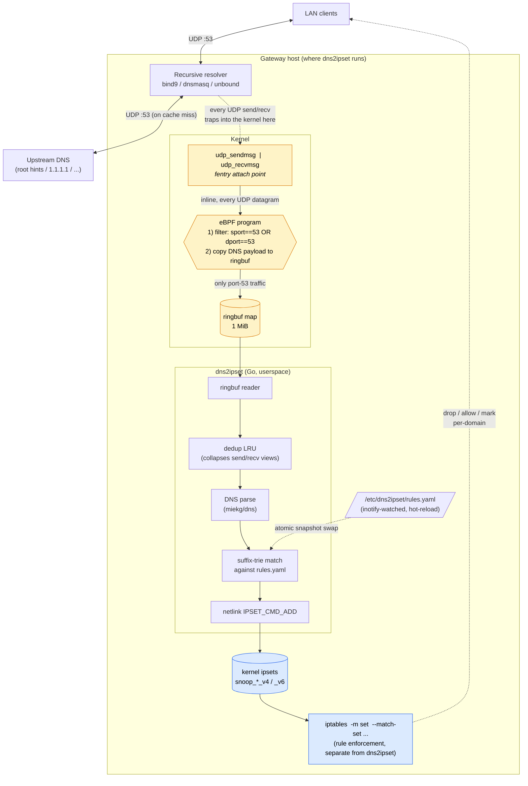

# dns2ipset with eBPF

Snoop DNS replies via eBPF and populate Linux kernel `ipset`s so `iptables`
can match traffic by domain. The eBPF observer is off the data path —
sub-microsecond overhead per packet, essentially no impact on DNS latency
under load.

See [docs/superpowers/specs/2026-05-09-dns2ipset-design.md](docs/superpowers/specs/2026-05-09-dns2ipset-design.md)
for the design and [CLAUDE.md](CLAUDE.md) for architecture and known limitations.

The intended deployment workflow is **build once on a build host, ship a
`.deb`, install on each gateway** — gateways do not need a Go/clang
toolchain. Thanks to CO-RE the same `.deb` works across kernel versions
(stock kernels ≥ 5.4 with BTF).

---

## Architecture

dns2ipset attaches **two eBPF programs** to the kernel via `fentry` at
`udp_sendmsg` and `udp_recvmsg`. Those are the syscall entry points every
UDP datagram traverses on its way in or out of any socket — so the daemon
sees every UDP packet processed by the host, regardless of which process
sent or received it. A port-53 filter inside the BPF program throws away
anything that isn't DNS; everything else is shipped up to userspace via a
ringbuf map. dns2ipset does not bind a socket, doesn't run as the
resolver, and isn't on the data path — it's a kernel-side observer.



**Where it snoops** (highlighted in amber above): the two `fentry` hooks
on `udp_sendmsg` and `udp_recvmsg`. Both hooks fire whether the resolver
served the answer from its cache or fetched it fresh from upstream — so
cached responses are observed too.

**What it does not do** (highlighted in blue above): create ipsets,
manage iptables, drop traffic, or otherwise affect the data path.
dns2ipset only *populates* sets that an upstream rule generator has
already created and that an iptables ruleset already references.

For the full design rationale and known limitations see
[CLAUDE.md](CLAUDE.md) and
[docs/superpowers/specs/2026-05-09-dns2ipset-design.md](docs/superpowers/specs/2026-05-09-dns2ipset-design.md).

---

## Build the .deb (on a build host)

Prerequisites (Debian 12 / Ubuntu 22.04, one-time):

- Linux ≥ 5.4 with BTF (`/sys/kernel/btf/vmlinux`)
- `clang` ≥ 10, `llvm`, `bpftool`, `libbpf-dev`, `linux-headers-$(uname -r)`
- Go ≥ 1.24

Then in the repo:

```
make generate          # regenerate vmlinux.h + run bpf2go
make package           # produces dns2ipset_<version>_amd64.deb
```

Version is sourced from `git describe --tags` (override with
`VERSION=1.2.3 make package`). Full walkthrough including the
cross-kernel verification matrix lives in
[docs/build-and-package.md](docs/build-and-package.md).

---

## Install on a gateway

Copy the `.deb` to the target host, then:

```
sudo apt install ./dns2ipset_<version>_amd64.deb
```

That installs `/usr/local/bin/dns2ipset`, the systemd unit, and an
example `/etc/dns2ipset/rules.example.yaml`. The postinst checks for BTF
and warns if it's missing. **It does not enable the service** — you
still need to pre-create ipsets and write your rules:

```
# 1. Pre-create each ipset referenced in your rules. dns2ipset does
#    not create sets — only adds entries. The `timeout` flag is
#    mandatory so per-entry TTLs from the daemon take effect.
sudo ipset create snoop_fb_v4 hash:ip family inet  timeout 86400
sudo ipset create snoop_fb_v6 hash:ip family inet6 timeout 86400

# 2. Write your rules.
sudo cp /etc/dns2ipset/rules.example.yaml /etc/dns2ipset/rules.yaml
sudo $EDITOR /etc/dns2ipset/rules.yaml

# 3. Enable and start.
sudo systemctl enable --now dns2ipset
sudo systemctl status dns2ipset --no-pager
```

To remove: `sudo apt remove dns2ipset` (purge with `apt purge` to also
delete `/etc/dns2ipset/`).

The systemd unit grants `CAP_BPF`, `CAP_PERFMON`, `CAP_NET_ADMIN` via
`AmbientCapabilities=` rather than running as root.

---

## Smoke test

After the steps above, on the gateway:

```
dig @127.0.0.1 www.facebook.com
sudo ipset list snoop_fb_v4
```

The resolved IPs should appear in the set within ~100 ms, with TTLs
near the DNS answer's. For the full end-to-end verification (atomic
reload, iptables loop closure, metrics) see
[docs/debian-vm-quickstart.md](docs/debian-vm-quickstart.md).

---

## From source (development)

For local hacking — runs the binary out of the repo without packaging:

```
make generate          # one-time, after fresh checkout
make build             # produces ./dns2ipset
sudo ./dns2ipset --rules /etc/dns2ipset/rules.yaml --log-level=debug
```

Tests:

```
go test ./... -race
make test-integration  # requires root + ipset (build-tag `integration`)
```

---

## More docs

- [CLAUDE.md](CLAUDE.md) — architecture, design choices, known limitations.
- [docs/build-and-package.md](docs/build-and-package.md) — operator-facing
  build-and-install walkthrough plus cross-kernel verification matrix.
- [docs/debian-vm-quickstart.md](docs/debian-vm-quickstart.md) — long-form
  end-to-end install + smoke test on a fresh Debian 12 VM (used as the
  build-host setup reference now that `.deb` install is the default
  target-host path).
- [docs/superpowers/specs/2026-05-09-dns2ipset-design.md](docs/superpowers/specs/2026-05-09-dns2ipset-design.md) — original design doc.
- [docs/superpowers/plans/2026-05-09-dns2ipset-implementation.md](docs/superpowers/plans/2026-05-09-dns2ipset-implementation.md) — 15-task TDD implementation plan.
